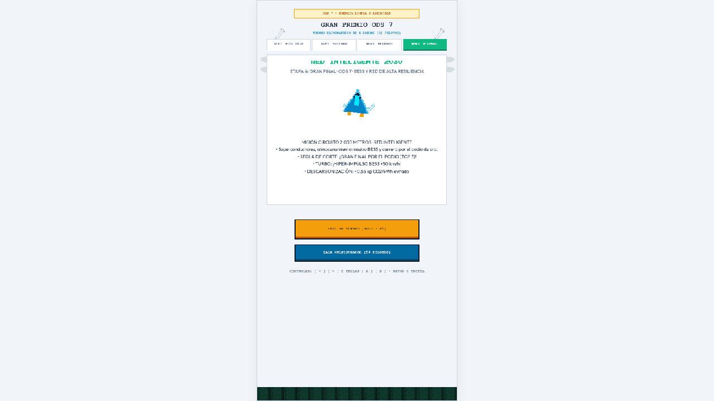
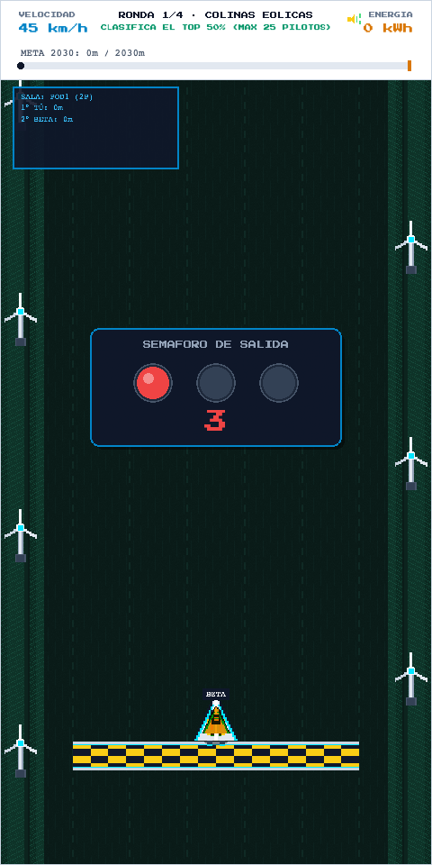
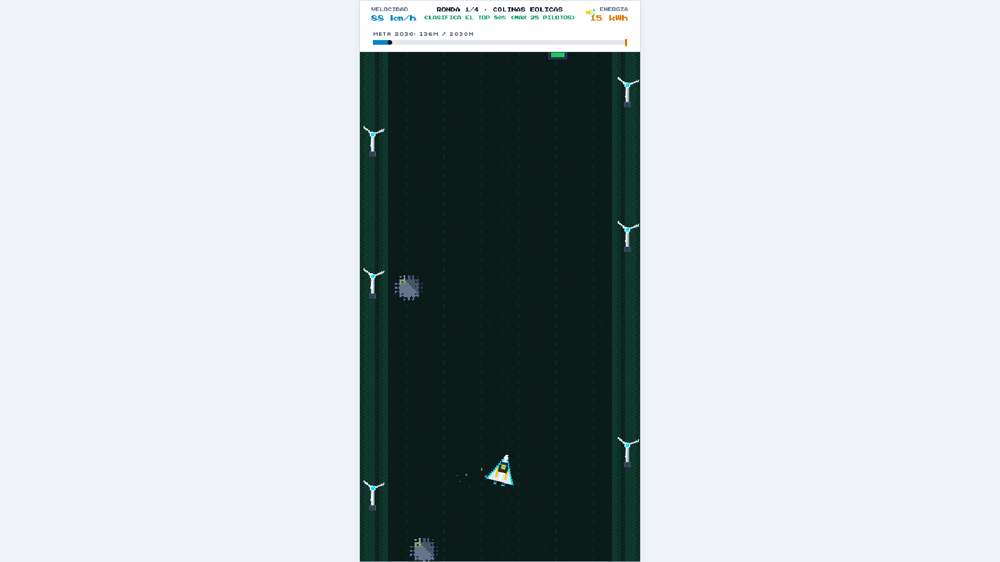
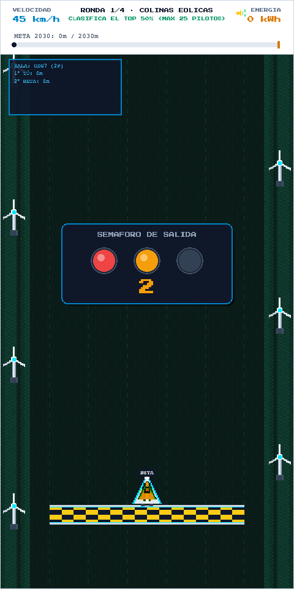
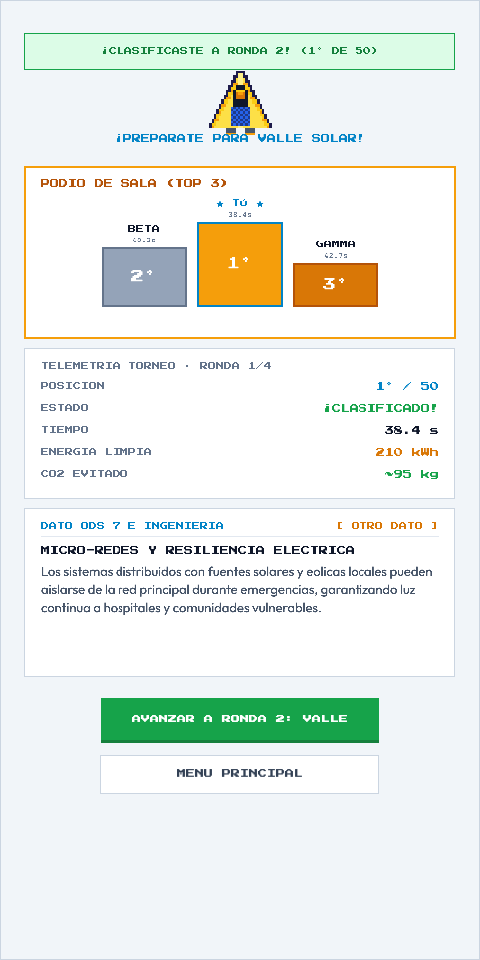
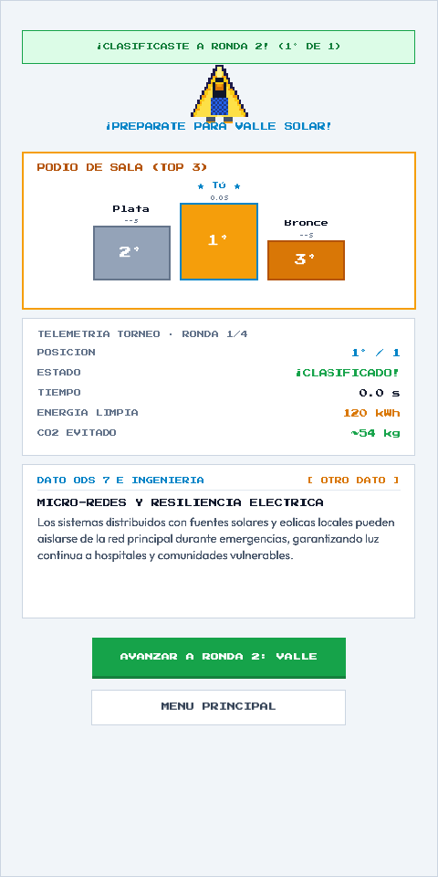
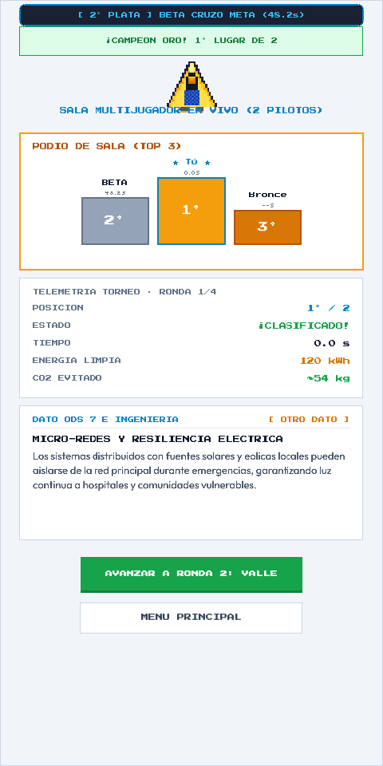
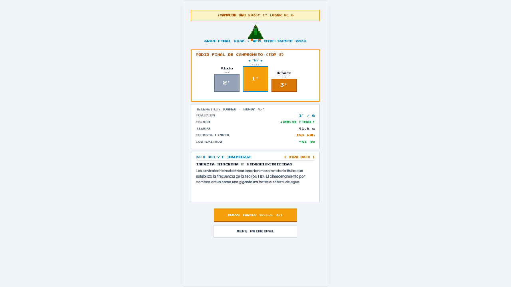

# ODS 7 - Red Eléctrica Inteligente y Sostenible

Juego arcade 2D en **Pixel Art** desarrollado con **Phaser 3.90.0**, **TypeScript** y **Vite**, enfocado en el **Objetivo de Desarrollo Sostenible 7 (Energía Asequible y No Contaminante)** y el rol de la ingeniería de sistemas en la transición energética global.

---

## Galería del Juego y Torneo (E2E Screenshots)

### 1. Menú Principal y Selección de Etapas (Gran Premio ODS 7)
| Ronda 1: Colinas Eólicas | Ronda 4: Red Inteligente 2030 |
| :---: | :---: |
|  |  |

### 2. Gameplay en Carrera y Semáforo de Salida
| Semáforo en Pista (3.. 2.. 1.. GO!) | Gameplay en PC Desktop (1080p / 60 FPS) |
| :---: | :---: |
|  |  |

### 3. Multijugador en Tiempo Real (WebSocket)
| Carrera Multijugador Sincronizada | Podio Multijugador (Top 1 al 3) |
| :---: | :---: |
|  |  |

### 4. Podio Dinámico en Vivo y Gran Final
| Esperando Rivales en Meta | Actualización en Vivo al Llegar Rivales | Gran Final (Podio Olímpico) |
| :---: | :---: | :---: |
|  |  |  |

---

## Mecánicas y Arquitectura

1. **Torneo Eliminatorio Gran Premio ODS 7 (Battle Royale)**:
   - **Ronda 1 - Colinas Eólicas**: 50 pilotos compiten; clasifica el 50% superior (25 pilotos).
   - **Ronda 2 - Valle Solar**: 25 pilotos compiten; clasifica el 50% superior (12 pilotos).
   - **Ronda 3 - Rápidos Hidroeléctricos**: 12 pilotos compiten; clasifica el 50% superior (6 pilotos).
   - **Ronda 4 - Red Inteligente 2030**: 6 finalistas compiten por el podio de honor (1° Oro, 2° Plata, 3° Bronce).
2. **Optimización Multijugador de Alta Concurrencia**:
   - Capacidad ampliada hasta 50 participantes por sala.
   - *Spatial Culling*: filtrado local de los 4 rivales más cercanos (2 adelante y 2 atrás) para minimizar consumo de CPU y renderizado de sprites.
   - Sincronización WebSocket a 10 Hz (tickrate cada 100ms) con interpolación de posición.
   - Podio en vivo en `WinScene`: los pilotos que cruzan la meta ven cómo se actualiza la tabla de posiciones dinámicamente cuando otros jugadores van completando el circuito.
3. **Escenario y Assets Procedurales en Pixel Art**:
   - 4 biomas energéticos con naves, pistas, barreras de contención, turbos y obstáculos propios.
   - Decoraciones laterales temáticas (aerogeneradores, colectores solares, torres hidroeléctricas, subestaciones eléctricas).
4. **Sintetizador Procedural Web Audio**:
   - Efectos sonoros sintetizados en tiempo real mediante la Web Audio API (aceleración, turbos, colisiones, arpegios y fanfarrias).

---

## Documentación de Pruebas Automatizadas (Playwright E2E)

El proyecto cuenta con una batería de 12 pruebas automatizadas de extremo a extremo:

### 1. `e2e/game.spec.ts` (Mecánicas Core y Progresión de Torneo)
- **Carga de Menú y Previews**: Valida el cambio de pestañas de las 4 rondas y visualización de biomas.
- **Guía Inicial ODS 7**: Verifica el modal explicativo con cuenta regresiva de 10 segundos y opción de omisión.
- **Controles de Conducción**: Prueba el desplazamiento lateral del planeador con teclas `A`/`D`, flechas y arrastre táctil / clic en pantalla.
- **Lecciones Pedagógicas en Pantalla de Victoria**: Verifica el cálculo de equivalencias de energía limpia (bombillas LED, hogares alimentados) y rotación de consejos ODS 7.
- **Progresión Completa R1 $\rightarrow$ R4**: Comprueba la clasificación consecutiva en las 4 rondas hasta la consagración en el podio final.
- **Pausa en Desenfoque**: Confirma que el juego se pausa automáticamente al cambiar de pestaña o perder el foco de la ventana.

### 2. `e2e/multiplayer.spec.ts` (Salas y Concurrencia WebSocket)
- **Conexión Multijugador**: Dos navegadores independientes se unen a la sala, inician la carrera simultáneamente y sincronizan sus posiciones en pista.
- **Podio 1° al 3°**: Valida que al finalizar se despliegue el podio oficial de los tres primeros lugares.

### 3. `e2e/live_podium.spec.ts` (Llegadas en Tiempo Real)
- **Llegada en Vivo a WinScene**: El Jugador 1 termina primero, ve la sala de espera y observa en tiempo real la llegada del Jugador 2 reflejada en el podio sin recargar la pantalla.

### 4. `e2e/desktop.spec.ts` (Rendimiento y Responsividad)
- **Compatibilidad de Pantalla**: Renderizado centrado y escalado nítido en resoluciones 1080p Desktop (1920x1080) y Laptop Estándar (1366x768).
- **Estabilidad de Fotogramas**: Medición de tasa de refresco a 60 FPS estables durante el gameplay.

---

## Ejecución Local

### Instalación de dependencias:
```bash
pnpm install
```

### Servidor de desarrollo:
```bash
pnpm run dev
```

### Ejecutar batería de pruebas Playwright:
```bash
pnpm run test:e2e
```

### Compilación para producción:
```bash
pnpm run build
```